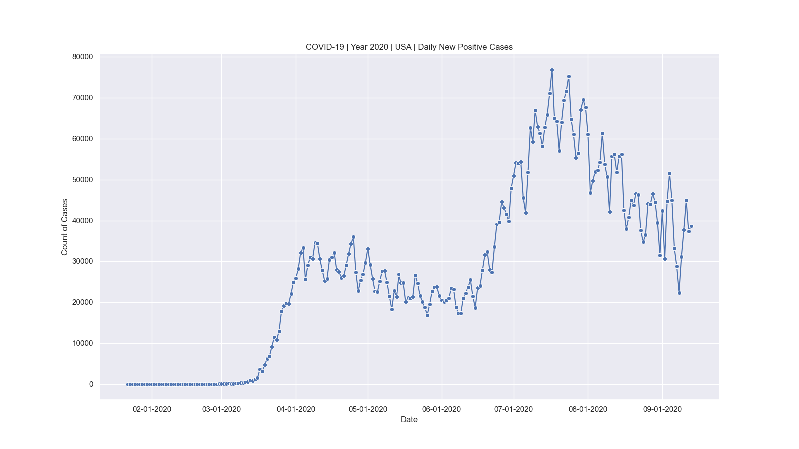
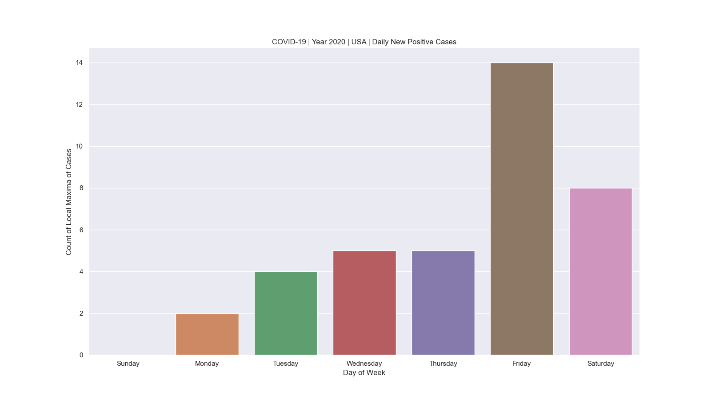
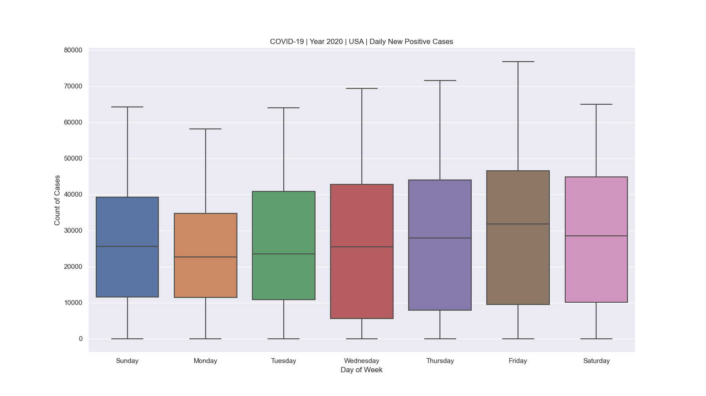
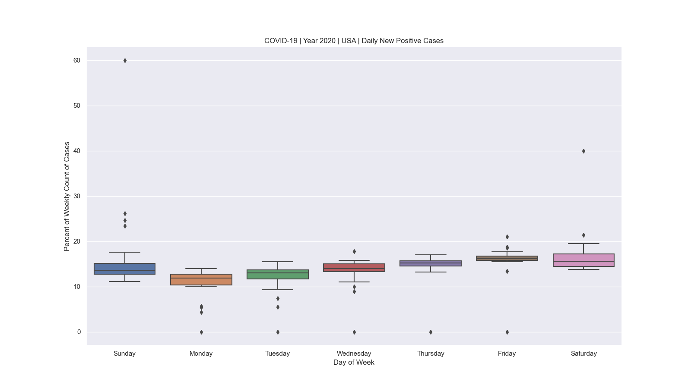
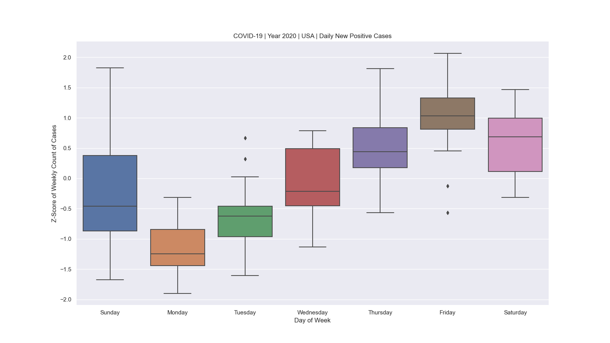

# COVID-19

[](https://semver.org)
[](https://www.python.org/downloads/release/python-376/)
[](https://github.com/pre-commit/pre-commit)
[](https://conventionalcommits.org)

## Introduction

This software project demonstrates how to enable collaborative, peer-reviewable
Agile data science at scale using a cloud-hosted [source code management (SCM)][SCM]
platform (e.g., GitHub). A single [Python][Python] script was develop to analyze a running
history of daily increases in positive cases of COVID-19 in the United States. A
future version of this would be modularized using Python packages.

## Getting Started

### System Requirements

This project supports 2 major operating systems:

* [Linux][Linux]
* [macOS][macOS]

To use or test this project, the following software must first be installed on your
system:

* [Python][Python] v3.7.6 or higher

In addition, this project has 3 third-party Python package dependencies:

* [matplotlib][matplotlib]
* [pandas][pandas]
* [seaborn][seaborn]

These packages come preloaded with the [Anaconda][Anaconda] distribution of
Python.

### Installation

To install this project, run the following command:

```shell
$ git clone https://github.com/djrlj694/COVID-19.git
```

## Files

Files in this project are organized as follows:

```bash
.
├── .editorconfig
├── .gitattributes
├── .github/
│   ├── ISSUE_TEMPLATE
│   │   └── .gitkeep
│   └── PULL_REQUEST_TEMPLATE
│       └── .gitkeep
├── .gitignore
├── .pre-commit-config.yaml
├── CODE_OF_CONDUCT.md
├── CONTRIBUTING.md
├── LICENSE
├── README.md
├── data/
│   ├── 01_raw/
│   │   └── daily_extract_data.csv
│   ├── 02_intermediate/
│   │   ├── daily_add_columns.csv
│   │   ├── daily_rename_columns.csv
│   │   └── weekly_add_columns.csv
│   └── 03_processed/
├── docs/
├── notebooks/
├── references/
├── results/
│   ├── plot_series.png
│   ├── summarize_dow.png
│   ├── summarize_dow_percent.png
│   ├── summarize_dow_zscore.png
│   └── summarize_maxima.png
└── src/
    └── main.py
```

### Source Code

The source code for this project consists of a single Python script file,
`main.py`, that does the following:

1. Downloads source data;
2. Extracts key measurements and categorical data;
3. Shapes the data via integration and the derivation of new data in preparation
   for visualization and summarization;
4. Appropriately labels processed data set with descriptive variable names;
5. Creates artifacts in the form of visualizations and summaries comprising the
   final results set.

### Source Data

All source data used in this project can be found using the [Data API][Data API] from the
[COVID Tracking Project][COVID Tracking Project]. The full URL of this
API's endpoint is:

`https://covidtracking.com/data/api/v1/us/`

Key files from this source are:

* `daily.csv`

A full description of this data is available in the *Historic US Values* section
of the site where it was obtained:

`https://covidtracking.com/data/api`

### Target Data

TODO: List the final target data processed after running `main.py`.

### Results

The following figures are visual summaries of daily counts of new positive
incidents of COVID-19 in the United States.







### Documentation

One documentation file is required to be included in the GitHub repository for
this project:

* `README.md`: This file, the intention of which is to clearly and understandably
explain how all of the scripts work and how they are connected with the other
analysis files cited here.

## Protocol

1. Extract data.
    1. Download the source data as a CSV file.
    2. Read the source data into a `pandas` data frame.
    3. Save a raw copy of the source data.
2. Transform data.
    1. Rename data columns.
    2. Add data columns.
3. Visualize data.
    1. Set graphic figure defaults.
    2. Generate and save graphic figures.

## Known Issues

Currently, there are no known issues.  If you discover any, please kindly submit
a [pull request](CONTRIBUTING.md).

## Contributing

Code and codeless (e.g., documentation) contributions toward improving the
COVID-19 project are welcome. See [CONTRIBUTING.md](CONTRIBUTING.md) for more
information on how to become a contributor.

## License

The COVID-19 project is released under the [MIT License](LICENSE).

## References

See [REFERENCES.md](REFERENCES.md) for a list of these.

[Anaconda]: https://www.anaconda.com/products/individual
[COVID Tracking Project]: https://covidtracking.com/
[Data API]: https://covidtracking.com/data/api
[Linux]: https://www.linuxfoundation.org
[macOS]: https://www.apple.com/macos/
[matplotlib]: https://matplotlib.org
[Python]: https://www.python.org
[pandas]: https://pandas.pydata.org
[SCM]: https://en.wikipedia.org/wiki/Version_control
[seaborn]: https://seaborn.pydata.org
